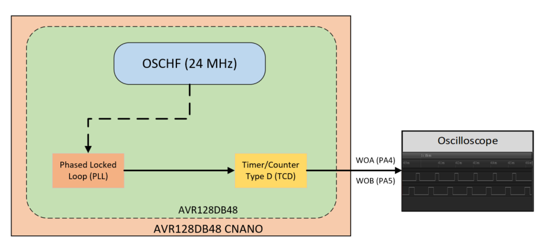

<!-- Please do not change this logo with link -->

#  High-Frequency Clock Signal Generation for TCD using PLL and Internal High-Frequency RC Oscillator (OSCHF) using AVR128DB48

This code example shows how the PLL feature of AVR128DB48 generates a high-frequency clock signal for the TCD peripheral of the AVR Dx family. In this code example, the PLL module is supplied with an OSCHF as input, to generate 48 MHz clock at its output. The generated 48 MHz clock signal is used as a clock input by the TCD peripheral.

## Introduction

To support the control applications, various features are incorporated in the microcontrollers. The high-speed PWM signal has a resolution that benefits the audio amplifiers, SMPS, LED Lighting, Pulse Power conversions, H-bridge drive, equalization networks, volume controls and much more. The clock signal controls the conversion rate of data, clock speed and accuracy (in terms of waveform generation).

The AVR128DB48 microcontrollers of the AVR® DB family have an internal high-frequency oscillator (OSCHF), which maintains outputs frequencies up to 24 MHz and supports the range of frequencies. This device supports a simplified set of features. It includes the Timer/Counter type D (TCD) which is a high-performance waveform generator. It contains compare logic that generates two independent outputs. OSCHF can be used as a main clock, peripheral clock or also as an input to the Phased Lock Loop (PLL). The PLL can be used to increase the frequency of the clock source. This code example demonstrates a high frequency clock signal generation for TCD peripheral using PLL and OSCHF as its clock input. The PWM signals WOA and WOB are generated with different Set and Clear timings and can be observed on any oscilloscope.

## Useful Links

- [Microchip University Courses](https://mu.microchip.com/page/all-courses)
- [Generating PWM Signals Using TCD with High-Frequency Input](https://ww1.microchip.com/downloads/en/Appnotes/Generating-PWMSignals-Using-TCD-with-HF-Input-DS90003236C.pdf)
- [AVR128DB48 Product Page](https://www.microchip.com/en-us/product/AVR128DB48)

## Description

This example shows how to generate a high-frequency clock signal for the TCD peripheral using the PLL feature with the OSCHF module. The TCD provides four different Waveform Generation modes. In this example, the TCD peripheral is configured in Two Ramp mode. The Compare A Set, Compare A Clear, Compare B Set, and Compare B Clear define when each state ends and begins. In Two Ramp mode, the TCD counter counts until it reaches the CMPACLR value, then it resets and counts until it reaches the CMPBCLR value. Here, the Compare A Set, Compare A Clear, Compare B Set, and Compare B Clear registers are set with 0 μs, 30 μs, 50 μs, and 80 μs values respectively. The PWM signals generated are routed to output on WOA and WOB. The signals generated on the WOA and WOB pins will have duty cycle of 10% and 20% respectively.

  
   Figure 1: System Block Diagram 

## Software  Tools

* MPLAB® X IDE [v6.05.0 or newer](https://www.microchip.com/mplab/mplab-x-ide)
* XC8 Compiler [v2.40.0 or newer](https://www.microchip.com/mplab/compilers)
* Microchip AVR-Dx_DFP Series Device Support Pack [2.3.272 or newer](https://packs.download.microchip.com/#collapse-Microchip-AVR-Dx-DFP-pdsc)
* MPLAB® Code Configurator [v5.2.2 or newer](https://www.microchip.com/mplab/mplab-code-configurator)
* TCD 4.0.12

***Note: For running the demo, the installed tool versions are expected to be the same or newer. This example is not tested with the previous versions.***

## Hardware Tools

* [AVR128DB48 Curiosity Nano](https://www.microchip.com/en-us/development-tool/EV35L43A)

## Application Firmware

The example firmware uses a TCD peripheral to scale up the system clock frequency. In this firmware, the system clock is configured to operate at 24 MHz. The TCD peripheral is configured to run at 48 MHz with PLL as its clock input. Here, the multiplication factor is set to 2x to scale up the input clock frequency. Configure the TCD peripheral in Two Ramp mode. The compare Set and Clear registers A, B are loaded with 10 μs, 30 μs, 50 μs and 80 μs. The TCD peripheral is configured in two ramp mode. The waveform outputs are observed when the TCD peripheral is enabled.

## Appendix

MPLAB® Code Configurator (MCC) is a graphical programming environment that generates seamless, easy-to-understand C code to give a head start to the project, saving the designer’s time to initialize and configure all the modules and go through the data sheets. Using an instructive interface, it enables and configures all peripherals and functions specific to the application requirements.

**Start by creating a new Project and open MCC**

* Open MPLAB X IDE
* Go to **File** and click **New Project**.
* Select **Microchip Embedded** and click **Standalone Project**.
* Enter the device name. In this case, select **AVR128DB48** device.
* Name the project.
* Launch MCC tool by navigating to **“Tools**, **Embedded** and **MPLAB Code Configurator v4: Open/Close”**. Alternatively, click the MCC icon to launch the MCC tool.

## System configuration

* **System Clock**
Open **Clock Control** setup present under **System** drop down menu in **Project Resources** tab.

* Clock Selection: **Internal high-frequency Osc**
* Internal Osc. Freq.: **1-32 MHz internal Osc**
* Osc. Freq. selection: **24 MHz**
* Multiplication Factor: **2x**
* Ext. clock source for PLL: **OSCHF**

  
   Figure 2: System Configuration 

* **TCD**
Open **TCD** setup present under **Driver** dropdown menu in **Project Resources** tab.

* Enable TCD
* Clock selection: **PLL**
* Compare A Set (μs): **10**
* Compare A Clear (μs): **30**
* Compare B Set (μs): **50**
* Compare A Clear (μs): **80**
* Waveform Generation Mode: **Two Ramp mode**
* Enable Compare Output Value

  
   Figure 3: TCD Configuration (Part-1) 

  
   Figure 4: TCD Configuration (Part-2) 

## Pin Mapping
The following images informs about the pin usage in the project.

  
   Figure 5: Pin Mapping (List View) 

  
   Figure 6: Pin Mapping (Navigation View) 

## Hardware Setup
The following figure consists of AVR128DB48 Curiosity Nano Evaluation kit along with Saleae Logic Analyzer. Connect the logic analyzer to the MCU using connecting cables.

  
   Figure 7: Hardware Setup 

## Demo Operation

* Make the hardware connections as shown in the hardware setup. Power up the Curiosity Nano board using micro-USB cable.
* Download the firmware available from the GitHub code example page.
* Build the project using latest version of tools as mentioned in the Software Tools section and flash the generated file on the AVR128DB48 microcontroller.
* Monitor the set and clear timings for waveform output A and B.

## Conclusion
This code example demonstrates generation of high frequency clock input to the TCD peripheral using PLL and OSCHF modules of the AVR128DB48 microcontroller. The real-world power stage control applications greatly benefitted with the TCD peripheral of AVR family of microcontrollers as it can generate high speed PWM waveform with a good resolution.
